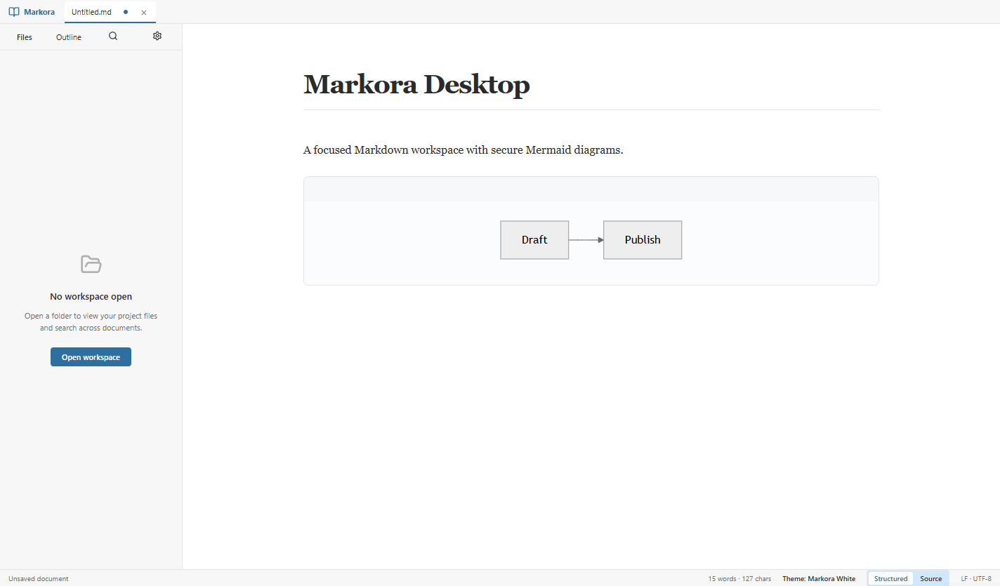

# Markora Desktop

Open-source visual Markdown editor for Windows.

[](https://github.com/mohamedazzim/markora-desktop/releases/latest)
[](https://github.com/mohamedazzim/markora-desktop/actions/workflows/ci.yml)
[](https://github.com/mohamedazzim/markora-desktop/actions/workflows/codeql.yml)
[](LICENSE)
[](https://github.com/mohamedazzim/markora-desktop/releases)
[](https://github.com/mohamedazzim/markora-desktop/stargazers)
[](https://github.com/mohamedazzim/markora-desktop#system-requirements)

Markora gives Markdown writers a document-first Windows workspace with a visual Structured Mode and a
faithful Source Mode. Both views are projections of one canonical Markdown document, so files remain
portable plain text and work well with Git, editors, and automation.



## Download Markora Desktop 0.2.2

The current public release is **0.2.2**. The installer is recommended for most users; the portable build
does not require installation.

| Package           | Recommended for              | Download                                                                                                                           |
| ----------------- | ---------------------------- | ---------------------------------------------------------------------------------------------------------------------------------- |
| Windows Installer | Normal installation          | [Download installer](https://github.com/mohamedazzim/markora-desktop/releases/download/v0.2.2/Markora-0.2.2-Setup-x64.exe)         |
| Portable Edition  | Running without installation | [Download portable build](https://github.com/mohamedazzim/markora-desktop/releases/download/v0.2.2/Markora-0.2.2-Portable-x64.exe) |
| Checksums         | Verifying downloaded files   | [Download SHA-256 checksums](https://github.com/mohamedazzim/markora-desktop/releases/download/v0.2.2/SHA256SUMS-0.2.2.txt)        |
| Release manifest  | Inspecting build metadata    | [Download manifest](https://github.com/mohamedazzim/markora-desktop/releases/download/v0.2.2/release-manifest-0.2.2.json)          |

- [Release notes and assets for v0.2.2](https://github.com/mohamedazzim/markora-desktop/releases/tag/v0.2.2)
- [Latest release](https://github.com/mohamedazzim/markora-desktop/releases/latest)

### Verify a download

Download `SHA256SUMS-0.2.2.txt` beside the installer and compare the reported hash with PowerShell:

```powershell
Get-FileHash `
  ".\Markora-0.2.2-Setup-x64.exe" `
  -Algorithm SHA256
```

The value must match the installer entry in the published checksum file. Release asset names contain the
version intentionally; maintainers must update every fixed filename in this table, the changelog, and the
release manifest as part of the [release process](docs/RELEASE_PROCESS.md).

## Feature highlights

- **Structured Mode** - edit rendered Markdown with Tiptap while preserving Markdown semantics.
- **Source Mode** - edit the original text with CodeMirror when exact syntax or large-file performance matters.
- **One document state** - switching views, saving, undo/redo, recovery, and conflict handling share one model.
- **Workspace tools** - tabs, collapsed-on-open workspace tree, outline navigation, and cancellable search.
- **Writing modes** - Focus, Typewriter, Zen, full-screen, configurable width, word wrap, and navigation commands.
- **Export** - styled/unstyled HTML, standalone HTML, and Chromium PDF; optional Pandoc formats when installed.
- **Windows packaging** - NSIS installer, portable build, and unpacked x64 build.

## Structured Mode

Structured Mode supports headings, paragraphs, emphasis, inline code, links, images, lists, task lists,
blockquotes, horizontal rules, code blocks, tables, math, Mermaid diagrams, alerts, and safe HTML. Context
controls appear only when relevant, keeping the writing surface quiet.

## Source Mode

Source Mode exposes the Markdown source in CodeMirror. It is the right choice for large documents,
unsupported syntax, precise whitespace edits, and reviewing a pending serialization change.

## Markdown support

The parser/serializer supports CommonMark and GFM features including front matter, tables, escaped pipes,
task lists, reference links, footnotes, fenced code, Unicode, CRLF/LF, and empty documents. Supported
constructs are normalized only when a visual edit requires serialization; see
[Markdown support](docs/MARKDOWN_SUPPORT.md) and [normalization rules](docs/MARKDOWN_NORMALIZATION.md).

## Math and Mermaid

KaTeX renders inline and display math locally. Mermaid fences render in strict security mode with no remote
execution. Diagram source remains available in Source Mode and can be edited through the diagram control.

## Workspace and file management

Open a folder to browse Markdown and other files, create tabs, reveal files, follow internal document links,
and search the workspace. Unsupported file types remain visible and produce a clear unsupported-format message
when selected; they are never silently discarded.

## Themes

Choose an application theme independently from a document theme. Built-in themes include Classic White,
Clean, Paper, Academic, Sepia, Graphite, Forest, Midnight, and High Contrast. Follow System is available,
and custom theme CSS is scoped so document styles cannot recolor dialogs or application controls.

## Export

HTML export supports standalone or fragment output, embedded CSS, local image embedding, syntax highlighting,
KaTeX, Mermaid, table of contents, internal links, and document metadata. PDF export uses Chromium print
controls and exposes page size, margins, scale, headers/footers, page numbers, theme, and print CSS options.

## Installation

1. Download the installer above.
2. Verify its SHA-256 checksum.
3. Run the installer and choose whether to create Start Menu and desktop shortcuts.
4. Open a `.md` or `.markdown` file through Markora or Windows **Open with**.

The portable build can be extracted and launched directly. The current Windows release is x64 and is not
code-signed; Windows SmartScreen may show an unsigned-binary warning.

## System requirements

- Windows 10 or Windows 11, x64
- 4 GB RAM recommended for ordinary documents
- Optional Pandoc installation for DOCX, ODT, RTF, EPUB, LaTeX, MediaWiki, and plain-text conversion

## Getting started

Create a document with **File > New**, type in Structured Mode, use **Source** for exact Markdown, and save
with **Ctrl+S**. Open a folder from the workspace sidebar when you need project navigation and search.

## Keyboard shortcuts

Common commands use familiar shortcuts: `Ctrl+N` new, `Ctrl+O` open, `Ctrl+S` save, `Ctrl+Z` undo,
`Ctrl+Y` redo, `Ctrl+F` find, and `Ctrl+Shift+P` command palette. See [shortcuts documentation](docs/SHORTCUTS.md)
for the current registry and customization behavior.

## Privacy

Markora does not collect document content or telemetry by default. Files stay local unless you explicitly
choose an external URL or export destination. See [PRIVACY.md](PRIVACY.md).

## Security

All filesystem access is validated through preload IPC, external links are checked, HTML is sanitized, and
Mermaid runs in strict mode. Report vulnerabilities privately using the process in [SECURITY.md](SECURITY.md).

## Build from source

```powershell
git clone https://github.com/mohamedazzim/markora-desktop.git
cd markora-desktop
npm ci
npm run doctor
npm run build
```

## Development setup

`npm start` and `npm run dev` launch the Vite renderer, Electron TypeScript watcher, and the installed local
Electron binary. `npm run dev:clean` removes generated Electron output before starting. See
[development setup](docs/DEVELOPMENT_SETUP.md) and the [environment fix audit](docs/DEVELOPMENT_ENVIRONMENT_FIX.md).

## Testing

Run `npm run verify` for typechecking, lint, unit, integration, accessibility, performance, and build checks.
The 0.2.2 verification record also includes real-Electron E2E coverage. A clean Windows VM/Sandbox pass was
not performed on this machine; see [testing](docs/TESTING.md).

## Documentation

- [Architecture](docs/ARCHITECTURE.md)
- [Feature matrix](docs/FEATURE_MATRIX.md)
- [Implementation status](docs/IMPLEMENTATION_STATUS.md)
- [Import and export](docs/IMPORT_EXPORT.md)
- [Themes](docs/THEMES.md)
- [Windows build](docs/WINDOWS_BUILD.md)
- [Release process](docs/RELEASE_PROCESS.md)
- [Known limitations](docs/KNOWN_LIMITATIONS.md)
- [Open-source documentation audit](docs/OPEN_SOURCE_DOCUMENTATION_AUDIT.md)

## Roadmap

The public roadmap tracks remaining polish such as clean-VM upgrade verification, broader native Windows
accessibility review, and additional export/import edge cases. Status is recorded in the feature matrix;
features are not marked complete without verification.

## Known limitations

The release is unsigned, Pandoc is optional, and a clean Windows VM/Sandbox installation was not performed
for this documentation pass. Very large documents may be better served by Source Mode. See the complete
[known limitations](docs/KNOWN_LIMITATIONS.md).

## Contributing

Read [CONTRIBUTING.md](CONTRIBUTING.md), run the verification commands, and keep changes scoped to the
desktop repository. Do not include user documents, credentials, generated release binaries, or private paths.

## Support

Use the [issue tracker](https://github.com/mohamedazzim/markora-desktop/issues) for reproducible bugs and
feature requests. Security reports belong in [GitHub Security Advisories](https://github.com/mohamedazzim/markora-desktop/security/advisories/new).

## Related Markora projects

- [Markora for VS Code](https://github.com/mohamedazzim/markora-vscode)
- [Markora for VS Code on the Marketplace](https://marketplace.visualstudio.com/items?itemName=MohamedAzzimJ.markora-markdown-editor)

## License

Markora Desktop is released under the [MIT License](LICENSE).

## Third-party licenses

Dependency and attribution details are documented in [THIRD_PARTY_LICENSES.md](THIRD_PARTY_LICENSES.md) and
[DEPENDENCY_LICENSE_REPORT.md](DEPENDENCY_LICENSE_REPORT.md).
