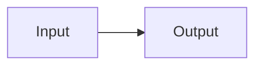

# Export fixture

[Jump to details](#details)

Inline math $E = mc^2$.

$$
\int_0^1 x^2\,dx
$$

```typescript
const greeting: string = 'Hello';
```



## Details

| Name    | Value |
| ------- | ----: |
| Unicode |  東京 |


<script>alert('never export')</script>
